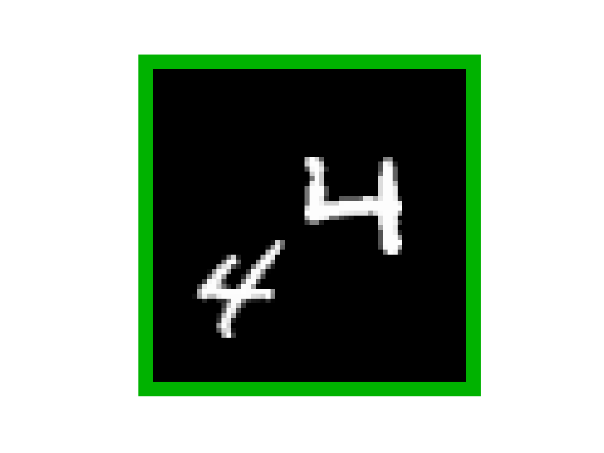
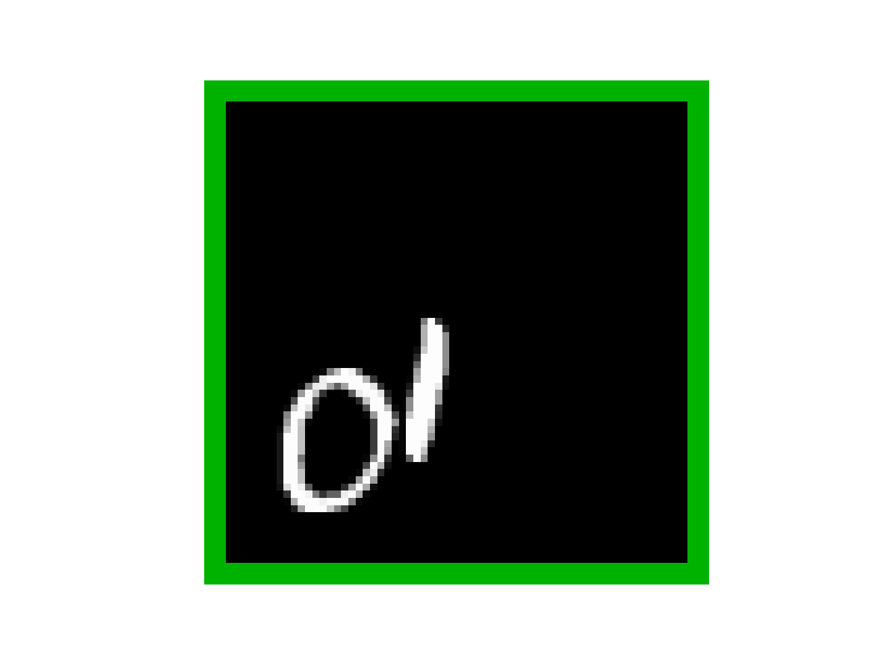
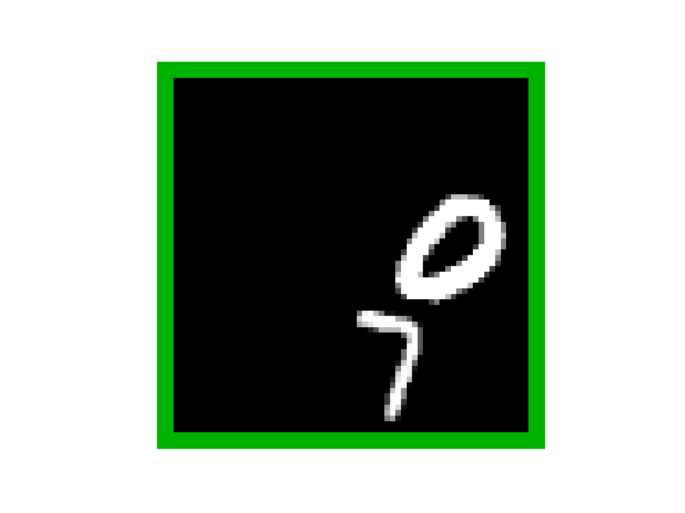
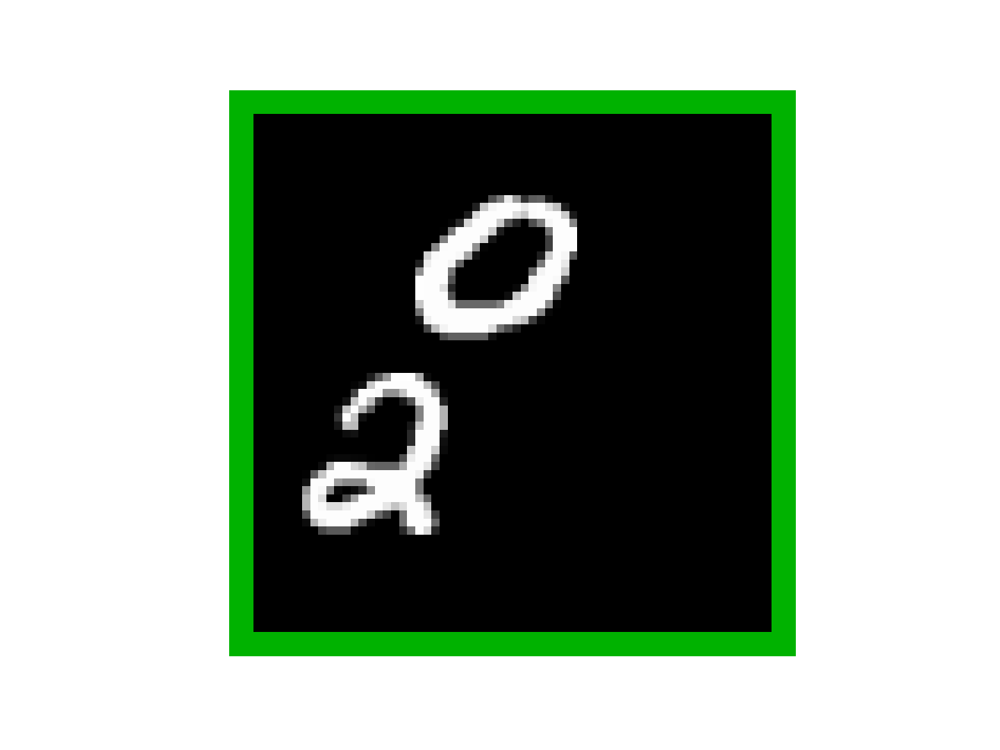
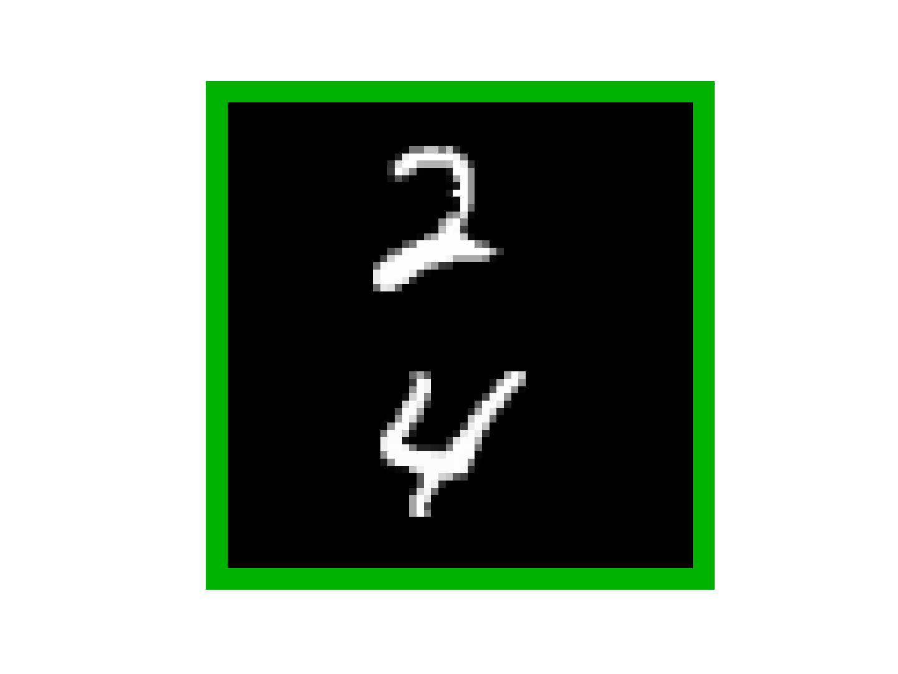
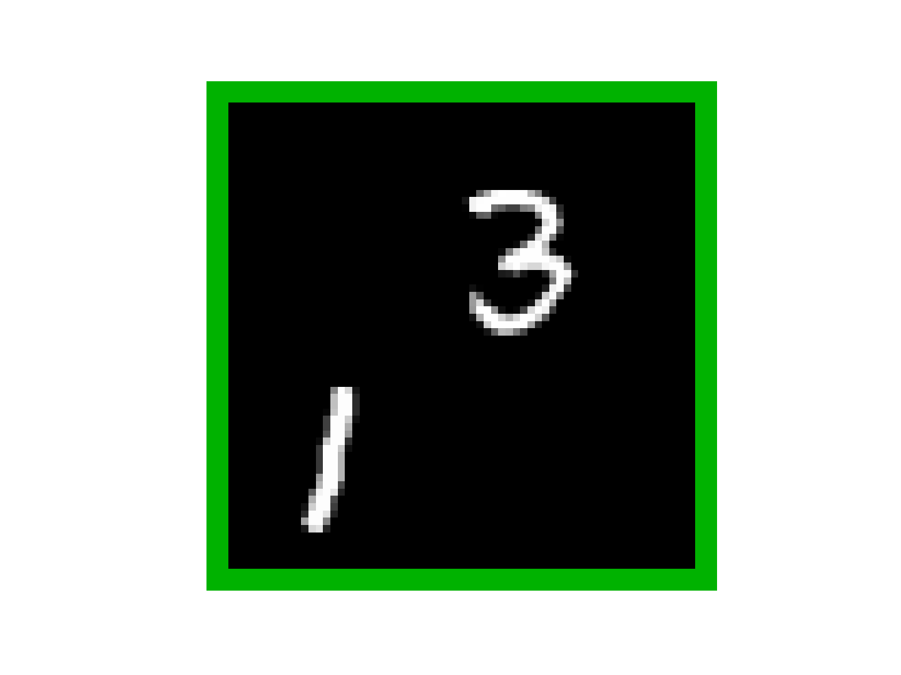

# Quantized Conditional COT-GAN for Video Prediction

This repository contains an implementation and further details of Quantized Conditional COT-GAN (QCCOT-GAN).

## Results 

## Data 

All datasets used in the experiments are publicly available.  

- The Moving MNIST dataset can be downloaded from [here](http://www.cs.toronto.edu/~nitish/unsupervised_video/).

- KTH human action dataset can be downloaded from [here](https://www.csc.kth.se/cvap/actions/). 

- All GQN datasets are available at [here](https://github.com/deepmind/gqn-datasets) and the GQN mazes dataset can be downloaded from [this GCP bucket](https://console.cloud.google.com/storage/browser/gqn-dataset/mazes?pageState=(%22StorageObjectListTable%22:(%22f%22:%22%255B%255D%22))&prefix=&forceOnObjectsSortingFiltering=false). 

## Results

--- | --- | ---
*Still* | `renders` | **nicely**

  |   |   |   
 |  |   |  
